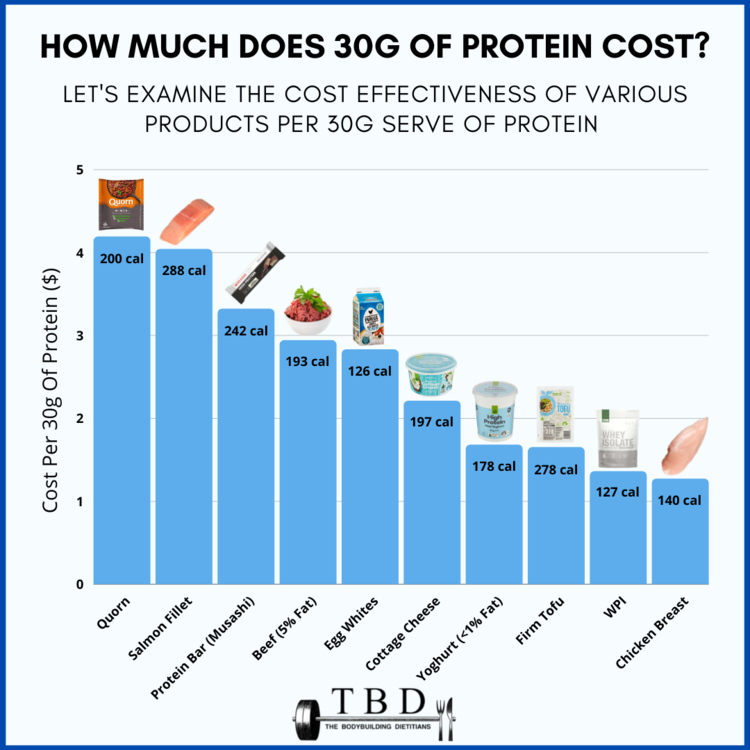
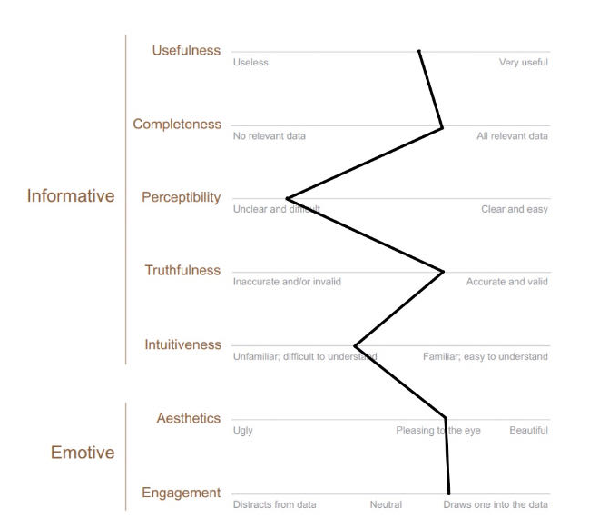
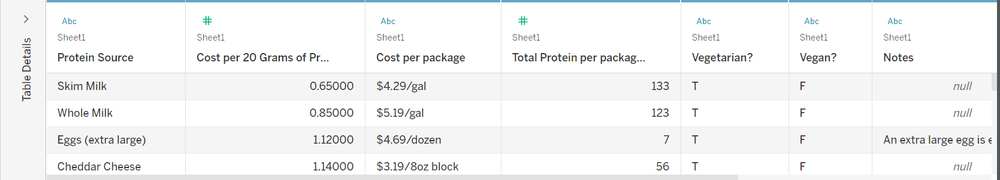
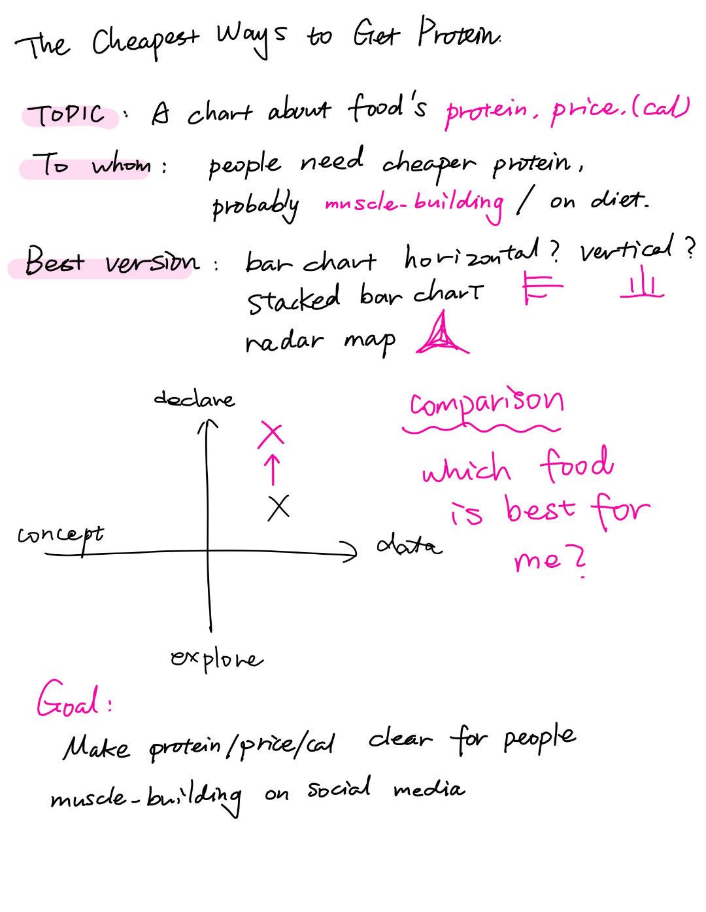
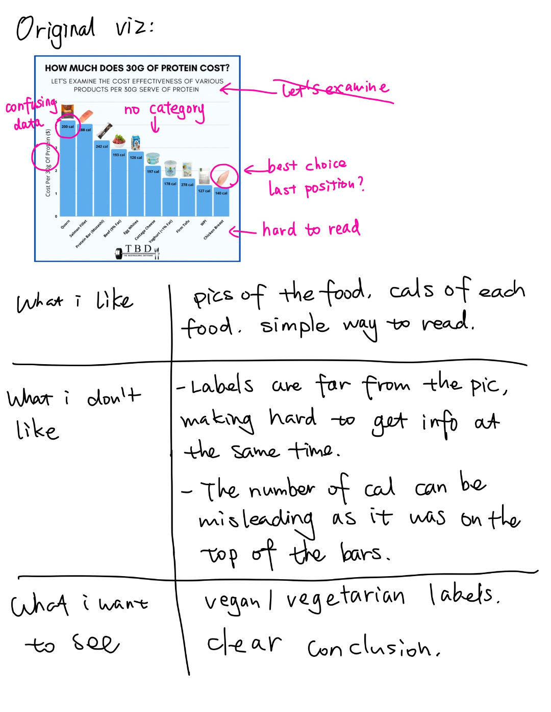
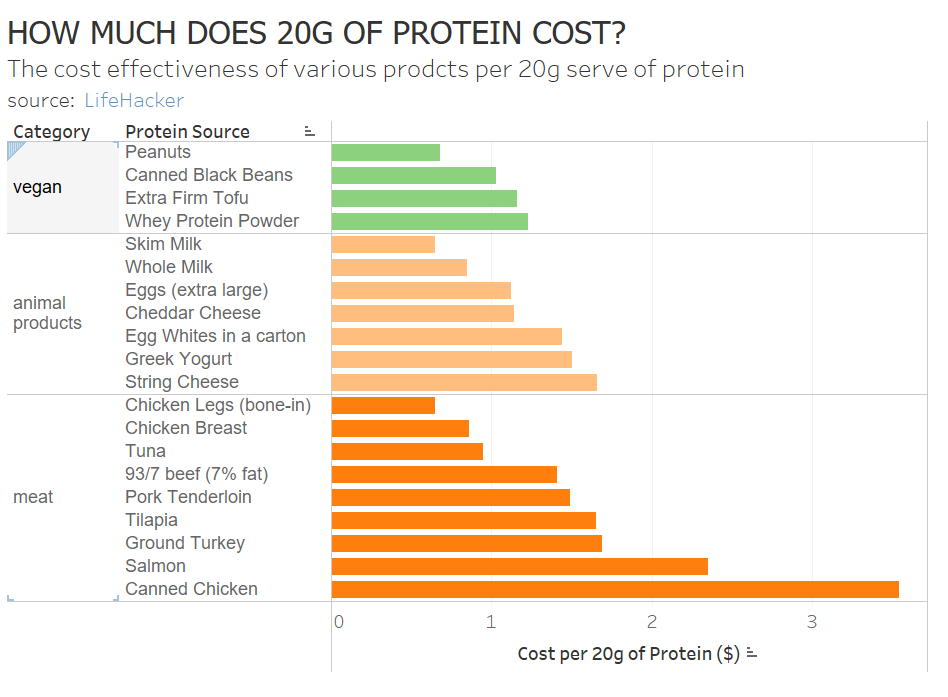

## Assignment 3 & 4: Critique by Design with Tableau (MakeoverMonday)
## Step 1: Choose and crituque
For step one, I choose a data visualization from MakeoverMonday. (avoid using examples created by other students, etc.). 
The links to the available visualizations can be found at https://www.makeovermonday.co.uk/data/. 

I chose <strong>2023/W8: The Cheapest Ways to Get Your Protein</strong>. https://data.world/makeovermonday/2023w8

Article/Data Source: 
<a href="https://lifehacker.com/the-cheapest-ways-to-get-your-protein-right-now-1850001760/" target="_blank">LifeHacker</a>

## Step 2: critique the data visualization
Using the data visualization selected from step one, complete a critique the visualization, this time using Stephen Few's Data Visualization Effectiveness Profile.

<strong>Who is the primary audience for this tool?  Do you think this visualization is effective for reaching that audience?  Why or why not? </strong>.

people who are muscle building or on diet. I think the viz is reachable cause it has an obvious title indicating the topic. The pics of products also make viz more attractive.

<strong>Describe your overall observations about the data visualization here.  What stood out to you?  What did you find worked really well?  What didn't?  What, if anything, would you do differently? </strong>.

I like the idea that we can see the cheapest protein of everyday foods. It also provides calorie to help making decisions for muscle-building or diet people. However, the numbers of cal were at the wrong place and caused misleading. I would remove the calorie and rank the foods' price in ascending order.  

<strong>Final thoughts: how successful what this method at evaluating the data visualization you selected? Are there measures you feel are missing or not being captured here?  What would you change?  Provide 1-2 recommendations (color, type of visualization, layout, etc.) </strong>.

Agreed. 2-dimension evaluation of conceptual and data driven is not enough to show the design part of viz. We can also evaluate our performance by aiming different audience, as different groups vary in scores. I would traverse the order to make chicken breast stands out.

## Step 3: sketch out a solution

Given the dataset with protein source, cost per 20g, cost per package, total protein, and two dummy variables about vegan and vegetarian, I was not able to redo the example cause the lacking of calorie. 

### Prepare work
To redesign the viz, I analyzed from these questions:

- <em>What do we want to talk about in this viz? </em>.
- <em>Who are our audience? </em>.
- <em>How can we create the viz? </em>.

Below are my sketch notes. 

  
  

### sketch making
As we are aiming to illustrate the differences between foods, this falls under the category of a comparison question. For this type of question, bar charts and radar charts are recommended. Therefore, I opted for a singular bar chart. Additionally, the assignment of different colors or using the same color for all categories is not an ideal choice for information acquisition. Consequently, I manually categorized the foods based on the <em>vegan? vegetarian?</em> variables and divided foods into <em> meat, animal products, and vegan</em>. I used green for vegan, yellow for animal products, and orange for meat

## Step 4: Test the solution
After completing the digital sketches, I interviewed two friends regarding their perspectives on visual imagery. The questions included:
- Can you tell me what you think this is?
- Can you describe to me what this is telling you?
- Is there anything you find surprising or confusing?
- Who do you think is the intended audience for this?
- Is there anything you would change or do differently?
  
The interview results are as follows, with personal information simplified to identity and age.

### interview 1： Student, 23, male
This is a chart displaying the prices of various foods with an equal amount of protein, aiming to inform the audience about the most cost-effective sources of protein. I believe that everyone can be the audience for this image. From the chart, I can see that, for example, peanuts are the cheapest source of protein among plants, while skim milk and chicken breast are also good protein sources. The products in each category are arranged from bottom to top, indicating higher prices as you go up. However, I feel that your sorting method has a vegetarian bias. Are you intending to promote vegetarianism? Because you have placed chicken breast at the bottom.

### interview 2： Student, 22, female
Your sketch is so good, it's just hard to review. Um, if I have a tight budget, but I don't know the exact price or the cost, I need to prepare cause you didn't put any exact data here. It's better to show all the prices, and then I'll have a better idea of how much I'm going to spend, rather than just looking at three or two pieces.

### In-class feedback
My team members think that my sketch is highly completed and has good effect. A team member asked that he could not immediately see the cheapest source of protein due to my category ordering. He suggested that I highlight the most cost-effective of all foods, in this case chicken breasts. Another female student liked the classification of vegetarians, believing that everyone can choose according to their own needs.

### Watch Me Viz video
The teacher used filter and dashboard to show vegan/ vegetarian. It is an interesting and fancy way to create interactive viz. Due to time limit, I was not able to solve this technological question of importing filters. But my color should be enough to show categories. Looking forward to use this tip later.

## Step 5: Build your solution
With the feedbacks and offical guide video, I made several revises on my digital sketch. 
Frist, many people said that they cannot know exactly which is the cheapest protein resource by looking at the blank bar, especially when comparing the minimum among three categories. The distance made comparison hard. The truth is that both chicken legs and silk milk have the lowest price but it was hard to distinguish that in the sketch. 

Second, I added an average line in the graph. Sometimes, people may want to eat more than one protein, they can choose cheaper protein as long as the food is below average line. After all, cheapest cannot always be the best.

<noscript></noscript><object class='tableauViz'  style='display:none;'><param name='host_url' value='https%3A%2F%2Fpublic.tableau.com%2F' /> <param name='embed_code_version' value='3' /> <param name='site_root' value='' /><param name='name' value='hw34_17000927033990&#47;Sheet1' /><param name='tabs' value='no' /><param name='toolbar' value='yes' /><param name='static_image' value='https:&#47;&#47;public.tableau.com&#47;static&#47;images&#47;hw&#47;hw34_17000927033990&#47;Sheet1&#47;1.png' /> <param name='animate_transition' value='yes' /><param name='display_static_image' value='yes' /><param name='display_spinner' value='yes' /><param name='display_overlay' value='yes' /><param name='display_count' value='yes' /><param name='language' value='en-GB' /><param name='filter' value='publish=yes' /></object>
                

