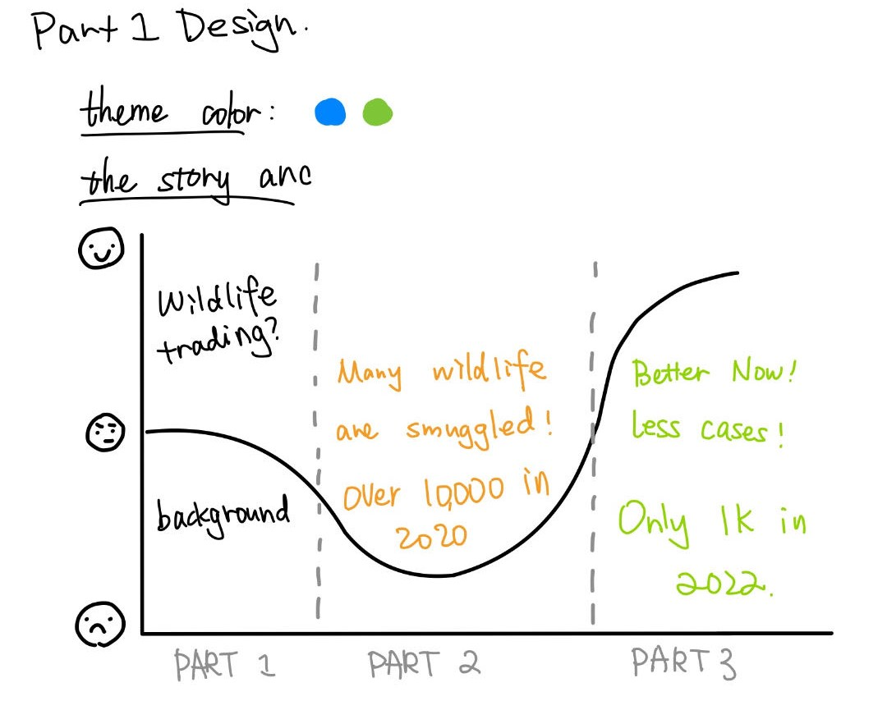
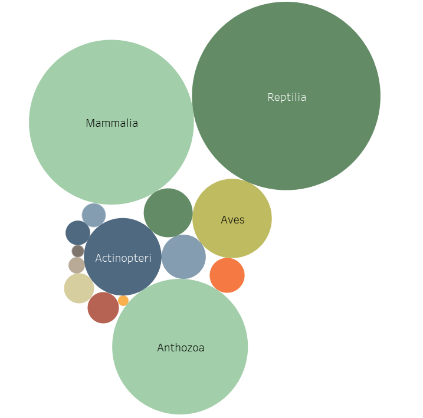
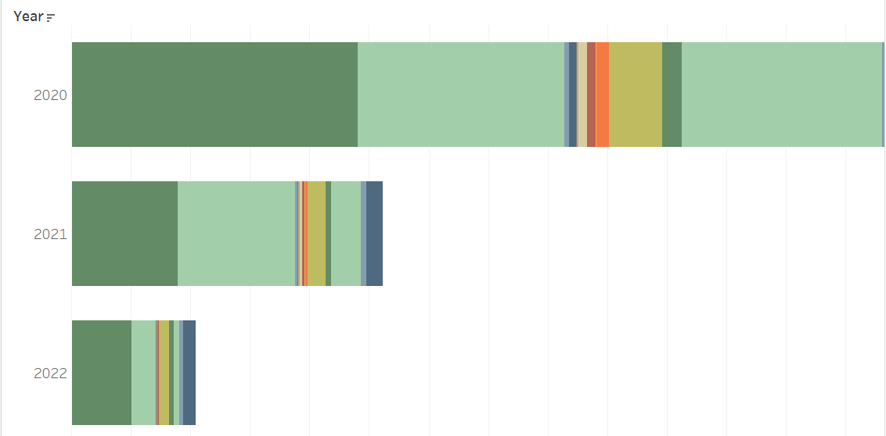
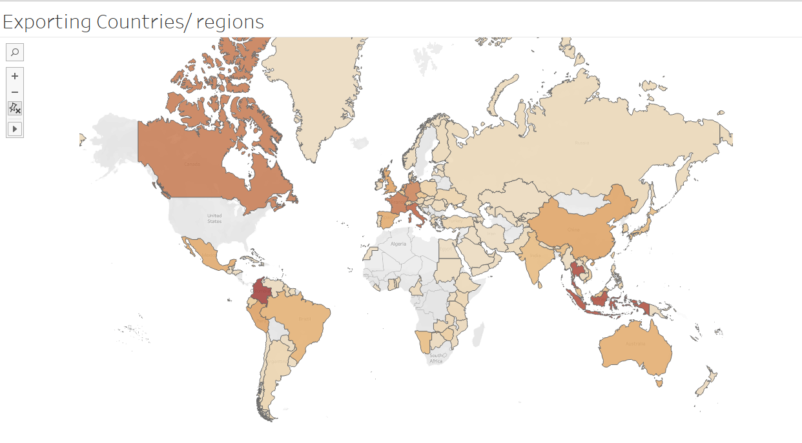

# Final Project Part 1
My final project aims to shed light on the issue of wildlife (and related products) trafficking through data visualization. Leveraging my internship experience at IFAW, I will focus on visualizing data from the CITES (Convention on International Trade in Endangered Species of Wild Fauna and Flora) database, specifically examining three years (2020-2022) of wildlife imports and products into the United States. The project will unfold in three main phases: visualizing trends in wildlife crimes across different species, analyzing the pathways of these crimes (e.g., shipping, concealment, air transport), and visualizing the sources and destinations of these illicit imports.

## Outline

### 1. Brief overview of wildlife trafficking and its impact.

### 2. Visualizing Wildlife Crime Trends:
- Subsection 1: Selecting key wildlife species/categories (e.g., mammals, reptiles, birds).
- Subsection 2: Utilizing temporal charts to depict changes in the number of wildlife crimes over the years.
- Subsection 3: Incorporating user stories and one-sentence summaries to highlight specific aspects of interest (e.g., spikes in certain species, patterns over time).

### 3. Analyzing Pathways of Wildlife Crimes:
- Subsection 1: Categorizing the modes of trafficking (e.g., express shipping, concealment, air transport).
- Subsection 2: Creating visualizations (charts, graphs) to illustrate the prevalence of each trafficking method.
- Subsection 3: Incorporating insights from user stories to provide context and depth to the analysis.

### 4. Visualizing Source and Destination Data:

- Subsection 1: Mapping the countries of origin for wildlife imports.
- Subsection 2: Mapping the destinations within the United States for these imports.
- Subsection 3: Using visualizations to identify trends or hotspots in both source and destination locations.

### 5. Emerging Insights and Further Exploration:
- Subsection 1: Allowing for flexibility to incorporate any unexpected findings during the visual exploration.
- Subsection 2: Encouraging user engagement and exploration through interactive elements in the visualizations.

### 6. Conclusion

## Initial sketches

I tried several ways to draw viz in tableau.

### 1. Show classes distribution in general

(personal speaking, i prefer the second one. Audience don't need to know the exact number but a general proportion).

### 2. Show classes distribution over time (2020-2022)

(Only show the top 4 classes, such as reptiles, Mammalia...And other compress to OTHER)

### 3. Show the modes of trafficking (can be over time period)
Need further processing.

### 4. Mapping exporting country

## The data
On the official open database websitem (https://trade.cites.org/) of CITES, we can get the Full CITES Trade Database download available (version 2023.1)
I selected data from 2020 to 2022, importing country = United States of America.

Part of the data:

| Year | App. | Taxon                  | Class         | Order         | Family           | Genus      | Importer | Exporter | Origin | Importer reported quantity | Exporter reported quantity | Term                     | Unit                | Purpose | Source |
|------|------|------------------------|---------------|---------------|------------------|------------|----------|----------|--------|----------------------------|-----------------------------|--------------------------|---------------------|---------|--------|
| 2020 | I    | Achatinella bulimoides | Gastropoda    | Stylommatophora| Achatinellidae   | Achatinella| US       | TZ       | XX     | 1                          |                             | trophies                 | Number of specimens | H       | W      |
| 2020 | I    | Ailurus fulgens        | Mammalia      | Carnivora     | Ailuridae        | Ailurus    | US       | CA       |        | 1                          |                             | live                     | Number of specimens | Z       | C      |
| 2020 | I    | Caiman latirostris      | Reptilia      | Crocodylia    | Alligatoridae    | Caiman     | US       | FR       | AR     | 1                          |                             | leather products (small) | Number of specimens | P       | I      |
| 2020 | I    | Araucaria araucana      |               | Pinales       | Araucariaceae    | Araucaria  | US       | NL       | GB     | 10                         |                             | seeds                    | kg                  | T       | A      |
| 2020 | I    | Araucaria araucana      |               | Pinales       | Araucariaceae    | Araucaria  | US       | NL       | GB     | 10                         |                             | seeds                    | kg                  | T       | D      |

## Method and medium
I am using my iPad and Tableau to help me sketch my drafts. Final data visualizations and the storyboard will be delivered via Tableau and Shorthand.

<em>GPT used for outline building.</em>
