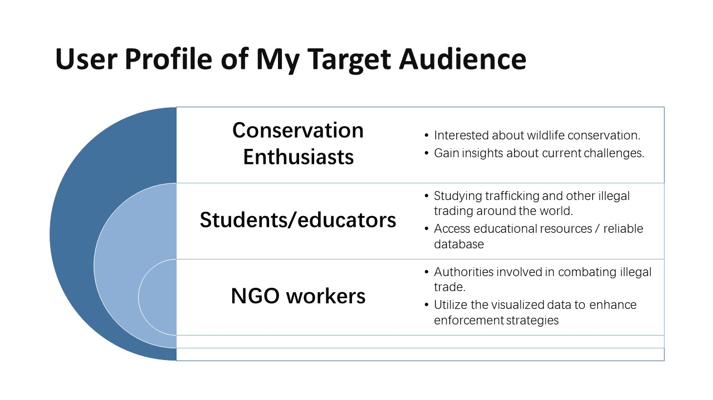

# Final Project Part 2

<del><strong> DEMO 1: </strong> https://preview.shorthand.com/h19Mp2BPGYPEmdUg</del>

<strong> DEMO 2: </strong> [https://preview.shorthand.com/h19Mp2BPGYPEmdUg](https://preview.shorthand.com/XrkuJ302A2U0CUV6)

## my assumption

## user research protocol
- the target audience you hope to reach with your story;
-  your approach to identifying representative individuals to interview;
- your interview script;
- the findings from your interviews;
- changes you plan on implementing to your visualizations next week to address the issues identified. 

## interview
### interview questions

- Who do you think is the intended audience for this?
- What is the emphasis of the story?
- What can you tell from the data visualization?
- How do you like the pace of this story?
- Is there anything you find confusing or unproper?
- List one part of visualization and one part you like and why.
- List one part of visualization and one part you dislike and why.

### interview notes

| Questions | Interview 1 (female, 20s)                                | Interview 2 (male, 20s)                                      |
|------------|------------------------------------------------------|--------------------------------------------------------------|
| 1. Audience | NGOs                                                 | People who are interested in wildlife conservation.           |
| 2. Story    | How serious the situation wild animals are facing, which kind of animals are threatened. | It’s more like a report, not really a story.                 |
| 3. Pace     | Pretty good, it would be better to add an agenda.     | The pace is calm but not as attractive as a story.             |
| 4. Viz      | It seems too many words in some pages.                 | Repetition on the first two vizs, showing similar information. Too many classes in the graph at the same time. Suggest zipping other classes into OTHERS and showing the trend over the years by a filled line graph. |
| 5. Likes    | Bubblesphere. Easy to understand what you want to illustrate. Like the visualization of charts, and pictures are very vivid and correlated. | Not mentioned.                                                            |
| 6. Dislikes | Lack of a general list, it may make me confused if I want to look through the project quickly. | The interactive map causes some trouble when scrolling down. And the pie chart cannot change correspondently with the context. |

## discuss on class
During the in-class discussion and feedbacks, I found that my narrative was a dataset breakdown rather then a stroy telling. So I narrowed down my data of wildlife species and focused on wildlife products that were made of ivory. I also extended the time period of 3 years. (covid affected the data trend a lot, especially for trafficking which is strongly related to traveling and transportation). 

## revise based on interviews
### New outline
Now the new story would be like:
- setup:  The number of elephants in Africa and Asia has a decreasing trend in the recent decades. There used to be many elephants in their habitats. But now we face illegal hunting threat.
- conflict:  Why this happen? Because people want ivory from elephants. The trafficking of ivory increased before 2017 in many countries and regions. People purchased ivory out of different purposes and through various ways, such as air, ship, etc.
- result:   After ivory forbidden, the trade of illegal ivory decreased and the hunting in Africa decreased, too. Trafficking could be controled by proper and well-implemented policies.
- ending:   Some sustainable development in elephant habitats.

### Data update & add on
Trafficking from CITES from 2009 - 2019 about ivory products: https://trade.cites.org/

| Year | App. | Taxon             | Class    | Order       | Family      | Genus | Importer | Exporter | Origin | Importer reported quantity | Exporter reported quantity | Term           | Unit | Purpose         | Source |
|------|------|-------------------|----------|-------------|-------------|-------|----------|----------|--------|-----------------------------|-----------------------------|----------------|------|-----------------|--------|
| 2013 | I    | Elephantidae spp. | Mammalia | Proboscidea | Elephantidae |       | US       | AT       | XX     | 2                           |                             | ivory carvings |      | P               | I      |
| 2013 | I    | Elephantidae spp. | Mammalia | Proboscidea | Elephantidae |       | US       | AT       | XX     | 52                          |                             | ivory carvings |      | P               | O      |
| 2013 | I    | Elephantidae spp. | Mammalia | Proboscidea | Elephantidae |       | US       | AT       | XX     | 1                           | 1                           | ivory carvings | Q    | O               |       |

The data of illegal elephant huntings in Africa: https://github.com/CITESmike2023/GLMM-2023-unweighted-model/blob/main/Data/carcasssummarytable_2023-07-28.csv

| UNRegion | SubregionName    | SubregionID | CountryName | CountryCode | MIKEsiteID | MIKEsiteName | Year | TotalNumberOfCarcasses | NumberOfIllegalCarcasses | Comments |
|----------|------------------|-------------|-------------|-------------|------------|--------------|------|------------------------|---------------------------|----------|
| Africa   | Southern Africa  | FS          | Zambia      | ZM          | KFE        | Kafue        | 2018 | 9                      | 7                         |          |
| Africa   | Southern Africa  | FS          | Zambia      | ZM          | KFE        | Kafue        | 2019 | 8                      | 5                         |          |
| Africa   | Southern Africa  | FS          | Zambia      | ZM          | KFE        | Kafue        | 2020 | 12                     | 8                         |          |
| Africa   | Southern Africa  | FS          | Zambia      | ZM          | KFE        | Kafue        | 2021 | 14                     | 7                         |          |

The data of elephant numbers in Africa and Asia: https://ourworldindata.org/elephant-populations#:~:text=In%202015%2C%20there%20were%20around,on%20the%20IUCN%20Red%20List.
<iframe src="https://ourworldindata.org/grapher/african-elephants?time=1995..2015" loading="lazy" style="width: 100%; height: 600px; border: 0px none;"></iframe>

## interview notes 2

| Questions | Interview                               | 
|------------|------------------------------------------------------|
| 1. Audience | It appears that the intended audience for this story is NGOs (Non-Governmental Organizations) with a focus on promoting the idea of boycotting the trade of ivory and highlighting the illegal nature of the chain.  | 
| 2. Story    | From the data visualization, one might infer information related to the demand for ivory products and the persistence of trade even after the ban. It could potentially provide insights into the motivations or reasons behind people continuing to buy ivory products despite the legal restrictions. |
| 3.Viz   | The charts are in different types, very easy to understand the theme of each slide and avoid aesthetic fatigue. | 

## Identified changes for Part III
> Document the changes you plan on implementing next week to address any issues identified.  

| Research synthesis                       | Anticipated changes for Part III                                                |
|------------------------------------------|---------------------------------------------------------------------------------|
| better understanding | Clear segmentation and conclusions are needed. |
|data viz| add clear titles or subtitles.|
| aesthetic |  use same theme color.|
| story-telling | emphasize the effect of Ban Acts. |
